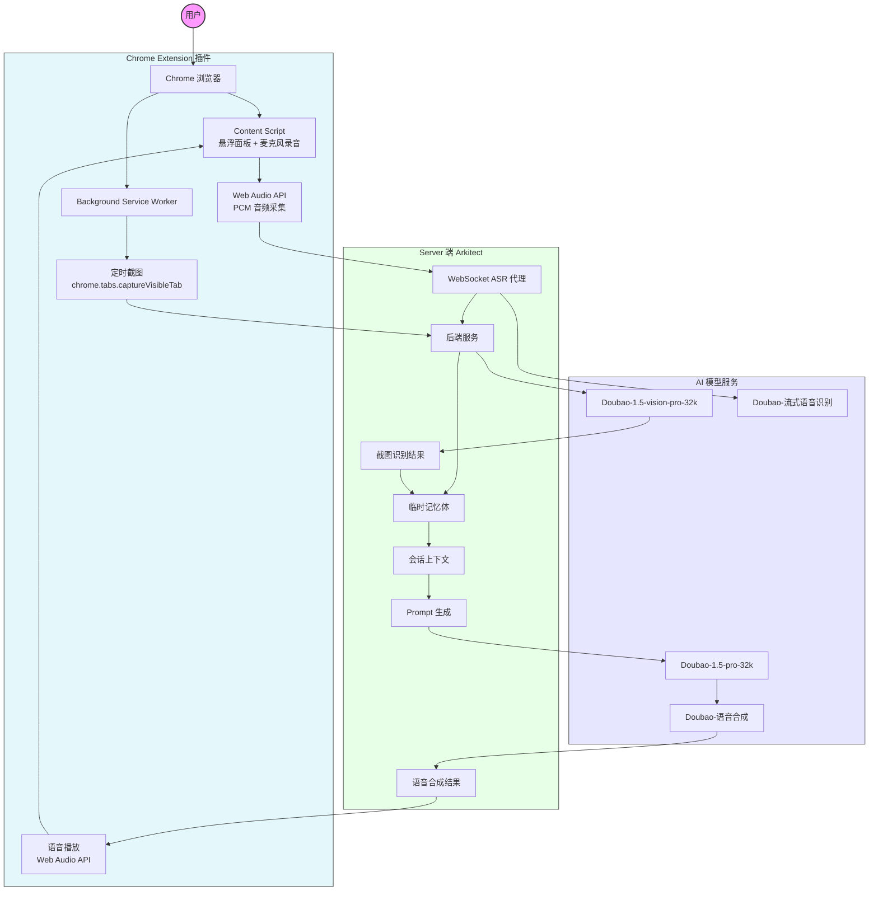

# 智能陪玩助手 Web Plugin - 网页端游戏 AI 陪玩插件

智能陪玩助手 网页端 Chrome 浏览器扩展插件。在你玩**电脑网页端游戏**时，AI 可实时看到你的游戏画面，陪你聊天、为你加油鼓劲！

## 架构图



## 对比 Android 端的适配变化

| 功能 | Android 端 | Web 插件端 |
|------|-----------|-----------|
| 屏幕截图 | MediaProjection API | `chrome.tabs.captureVisibleTab()` |
| 语音录制 | AudioRecord (PCM 16bit) | Web Audio API + ScriptProcessorNode |
| 语音识别 | WebSocket 直连 Doubao ASR | 服务端 WebSocket 代理转发 |
| 语音播放 | MediaPlayer | Web Audio API / HTML5 Audio |
| UI 界面 | Jetpack Compose Activity | Content Script 注入悬浮面板 |
| 配置管理 | Activity 输入框 | Extension Popup + chrome.storage |
| 后台运行 | Foreground Service | Service Worker + chrome.alarms |

## 快速开始

### 1. 启动后端服务

参考 [server/README.md](../server/README.md) 启动后端服务，后端已内置 CORS 跨域支持和 WebSocket ASR 代理。

需要额外安装 `websockets` 依赖：

```bash
cd server/
pip install websockets
```

### 2. 安装 Chrome 扩展

1. 打开 Chrome 浏览器，访问 `chrome://extensions/`
2. 开启右上角的 **开发者模式**
3. 点击 **加载已解压的扩展程序**
4. 选择 `web-plugin/` 目录

> **图标说明**：首次安装需要准备 16x16、48x48、128x128 的 PNG 图标文件，放在 `icons/` 目录。
> 可用 `icons/icon.svg` 作为源文件生成不同尺寸的 PNG。

### 3. 配置插件

1. 点击浏览器工具栏的 智能陪玩助手 图标
2. 填写配置：
   - **服务器地址**：后端服务地址（如 `127.0.0.1:8888`）
   - **ASR App ID**：语音识别 App ID
   - **ASR Access Token**：语音识别 Access Token
   - **截图间隔**：自动截图的时间间隔（默认 3 秒）
3. 点击 **保存设置**

### 4. 开始陪玩

1. 打开你要玩的网页游戏
2. 点击 智能陪玩助手 插件图标 → **启动陪玩**
3. 页面右下角出现 智能陪玩助手 悬浮面板
4. 插件会自动定时截图分析游戏画面
5. 点击麦克风按钮可以语音对话

## 项目结构

```
web-plugin/
├── manifest.json      # Chrome Extension Manifest V3 配置
├── background.js      # Service Worker —— 截图调度、ASR通信、后端API调用
├── content.js         # Content Script —— 注入游戏页面的悬浮面板 + 录音
├── content.css        # 悬浮面板样式
├── popup.html         # 扩展弹出窗口 —— 设置界面
├── popup.js           # 设置界面逻辑
├── popup.css          # 设置界面样式
├── icons/             # 扩展图标
│   └── icon.svg       # SVG 源图标
└── README.md          # 本文档
```

## 技术栈

- Chrome Extension Manifest V3
- Web Audio API（麦克风录音）
- chrome.tabs.captureVisibleTab（屏幕截图）
- WebSocket（语音识别通信）
- chrome.storage（配置持久化）

## 注意事项

1. **截图权限**：`chrome.tabs.captureVisibleTab` 需要 `activeTab` 权限，仅能截取当前活跃标签页
2. **麦克风权限**：首次使用语音功能时，浏览器会弹出麦克风授权请求
3. **跨域请求**：服务端已添加 CORS 中间件，支持浏览器插件直接请求
4. **ASR 代理**：由于浏览器 WebSocket 无法携带自定义 Header 连接 Doubao ASR，通过服务端 `/ws/asr` 端点代理转发
5. **网页游戏兼容**：支持任何在浏览器中运行的网页游戏（HTML5 游戏、Flash 游戏、WebGL 游戏等）
